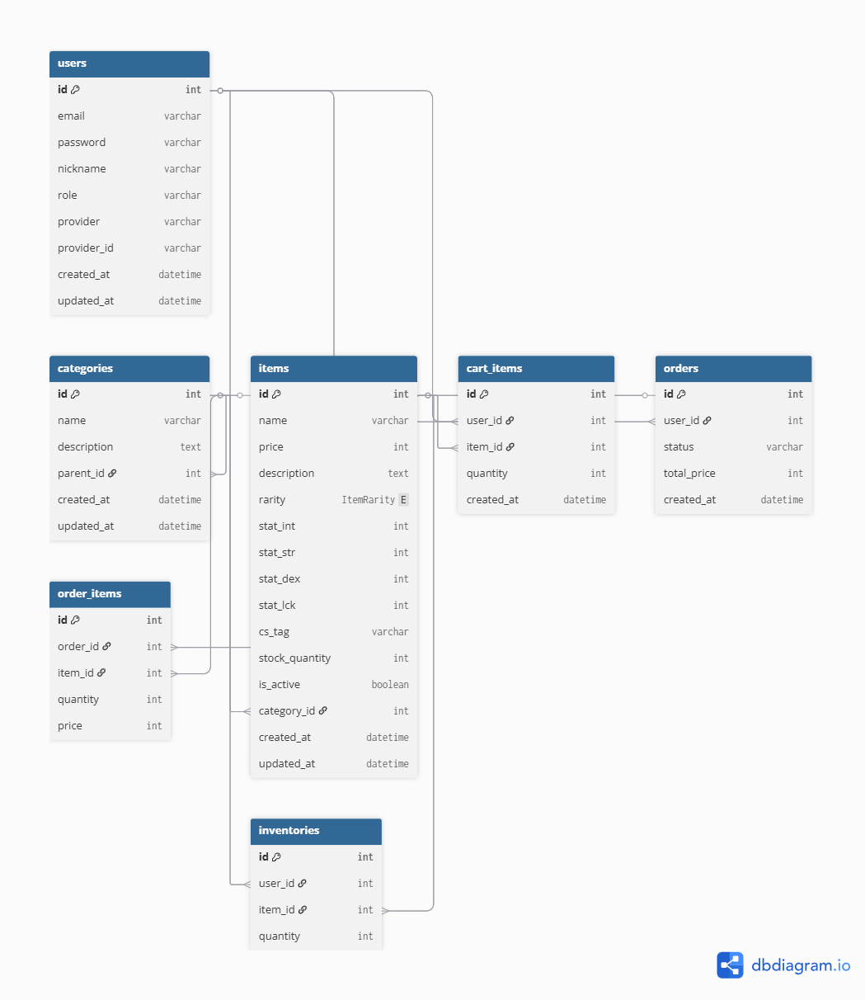

# DB Schema (Prisma / MySQL)

> 본 문서는 **Prisma schema.prisma + migrations + seed.js**를 기준으로, 프로젝트의 **ERD(개념) / 인덱스 / 시드 데이터**를 정리합니다.  
> (레포 위치: `backend/prisma/schema.prisma`, `backend/prisma/migrations/`, `backend/prisma/seed.js`)

---

## 1. 데이터 모델 개요

### 1-1. 핵심 엔티티(리소스)

- **User**: 사용자(일반/관리자), 소셜 로그인 provider 정보 포함
- **Category**: 아이템 분류(상위/하위 계층 구조)
- **Item**: 상품(판타지 CS 아이템) + 스탯/희귀도/재고
- **CartItem**: 장바구니 항목(User–Item N:M의 중간 테이블)
- **Order**: 주문(결제 전/후 상태 등은 서비스 로직에서 확장 가능)
- **OrderItem**: 주문 상세 항목(Order–Item N:M의 중간 테이블)
- **Inventory**: 유저 보유 아이템(User–Item N:M의 중간 테이블)

### 1-2. ERD 관계 요약

```text
User 1 ── N CartItem N ── 1 Item
User 1 ── N Order   1 ── N OrderItem N ── 1 Item
User 1 ── N Inventory N ── 1 Item

Category 1 ── N Item
Category 1 ── N Category (self: parent/children)
```

---

## 2. 테이블/컬럼 설명 (schema.prisma 기준)

> 아래는 교수님 검토를 위한 “요약”이며, 전체 스키마는 `schema.prisma`를 소스 오브 트루스로 봅니다.

### 2-1. `users` (User)

- 주요 컬럼
  - `id` (PK)
  - `email` (**UNIQUE**)
  - `password` (bcrypt 해시 저장 전제)
  - `nickname`
  - `role` (기본: `ROLE_USER`)
  - `provider` / `provider_id` (소셜 로그인 식별자)
  - `created_at`, `updated_at`

- 관계
  - `User 1:N CartItem`
  - `User 1:N Order`
  - `User 1:N Inventory`

### 2-2. `categories` (Category)

- 주요 컬럼
  - `id` (PK)
  - `name`
  - `description`
  - `parent_id` (self FK, nullable)
  - `created_at`, `updated_at`

- 관계
  - `Category(부모) 1:N Category(자식)`
  - `Category 1:N Item`

### 2-3. `items` (Item)

- 주요 컬럼
  - `id` (PK)
  - `name`
  - `price`
  - `description` (nullable)
  - `rarity` (`ItemRarity`: COMMON/RARE/EPIC/LEGENDARY)
  - 스탯: `stat_int`, `stat_str`, `stat_dex`, `stat_lck`
  - `cs_tag` (검색/필터 태그, nullable)
  - `stock_quantity` (재고)
  - `is_active` (판매 여부)
  - `category_id` (FK, nullable)
  - `created_at`, `updated_at`

- 관계
  - `Item N:1 Category (nullable)`
  - `Item 1:N CartItem`
  - `Item 1:N OrderItem`
  - `Item 1:N Inventory`

### 2-4. `cart_items` (CartItem)

- 주요 컬럼
  - `id` (PK)
  - `user_id` (FK)
  - `item_id` (FK)
  - `quantity`
  - `created_at`, `updated_at`

- 제약
  - **UNIQUE(user_id, item_id)** : 동일 유저의 동일 아이템 중복 담기 방지

### 2-5. `orders` (Order)

- 주요 컬럼
  - `id` (PK)
  - `user_id` (FK)
  - `total_price`
  - `created_at`, `updated_at`

- 관계
  - `Order 1:N OrderItem`

### 2-6. `order_items` (OrderItem)

- 주요 컬럼
  - `id` (PK)
  - `order_id` (FK)
  - `item_id` (FK)
  - `quantity`
  - `price` (주문 시점 단가 스냅샷)
  - `created_at`, `updated_at`

### 2-7. `inventories` (Inventory)

- 주요 컬럼
  - `id` (PK)
  - `user_id` (FK)
  - `item_id` (FK)
  - `quantity`

- 제약
  - **UNIQUE(user_id, item_id)** : 동일 유저의 동일 아이템 보유 레코드 중복 방지

---

## 3. 인덱스 / 제약조건

### 3-1. Prisma 스키마에 선언된 인덱스/유니크

| 테이블 | 타입 | 대상 | 목적 |
|---|---|---|---|
| `users` | UNIQUE | `email` | 이메일 중복 방지 |
| `users` | INDEX | `(provider, provider_id)` | 소셜 로그인 사용자 조회 최적화 |
| `categories` | INDEX | `name` | 카테고리 이름 검색/정렬 |
| `items` | INDEX | `category_id` | 카테고리 기반 목록/필터 |
| `items` | INDEX | `price` | 가격 정렬/필터 |
| `items` | INDEX | `rarity` | 희귀도 필터 |
| `items` | INDEX | `cs_tag` | 태그 검색/필터 |
| `items` | INDEX | `created_at` | 최신순 정렬 |
| `cart_items` | UNIQUE | `(user_id, item_id)` | 장바구니 중복 방지 |
| `inventories` | UNIQUE | `(user_id, item_id)` | 인벤토리 중복 방지 |

### 3-2. migrations에서 확인되는 FK

Prisma migrate SQL(`backend/prisma/migrations`) 기준으로 확인되는 FK는 아래와 같습니다.

- `categories.parent_id → categories.id` (ON DELETE SET NULL)
- `items.category_id → categories.id` (ON DELETE SET NULL)

> 참고: `CartItem/Order/OrderItem/Inventory`의 FK는 `schema.prisma`에 관계로 정의되어 있으며,  
> 현재 레포의 migrations 폴더에는 **해당 테이블 생성 SQL이 포함되어 있지 않을 수 있습니다**.  
> (즉, DB를 완전히 재생성/마이그레이션할 경우, 최종 스키마 기준으로 migrate가 추가 필요할 수 있습니다.)

---

## 4. 마이그레이션 구성 (migrations/)

현재 포함된 마이그레이션 폴더(레포 기준):

- `20251205053151_init`
- `20251205055219_add_item_fields`
- `20251207052038_add_item_category_enums`

> 주요 변경 흐름(요약)
- 초기(User/Item) 테이블 생성
- Item 필드 추가(스탯/태그/재고 등)
- users/categories/items 테이블 구조 재정리 및 enum/카테고리 도입

---

## 5. 시드 데이터 (seed.js)

시드 스크립트: `backend/prisma/seed.js`

### 5-1. 생성 데이터 종류

- **Category**: 계층형 카테고리(상위/하위)
- **Item**: 자동 생성된 아이템(이름/태그/희귀도/스탯/가격/카테고리 등)

### 5-2. 생성 개수(코드 기준)

- `Category`: **13개**
- `Item`: **260개** (for-loop로 생성)

seed 실행 로그(코드 기준) 예시:
- `"Seed completed: 260 items + 13 categories"`

### 5-3. 데이터 품질 포인트

- `ItemRarity`는 가중치 기반 랜덤 선택(희귀 아이템이 적게 생성)
- `cs_tag`는 이름/주제와 일치하도록 설정되어 **검색/필터 테스트**에 유리
- `items.category_id`는 존재하는 `categorySeed`의 id 중에서 랜덤 부여

---

## 6. ERD 구조도
